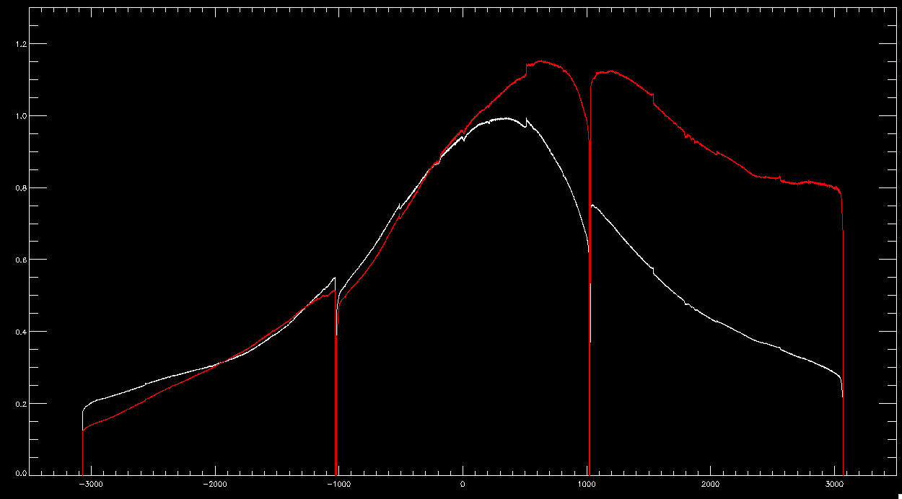
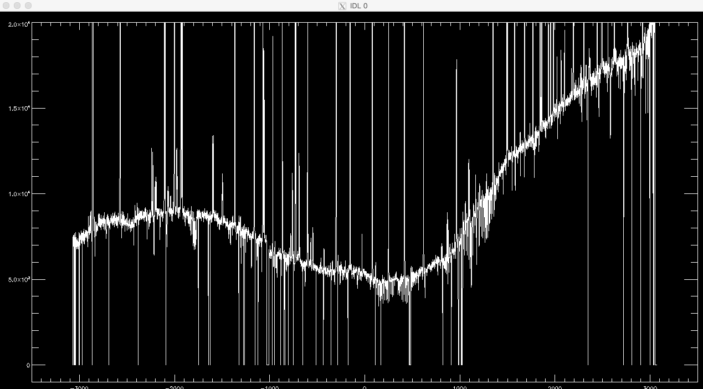
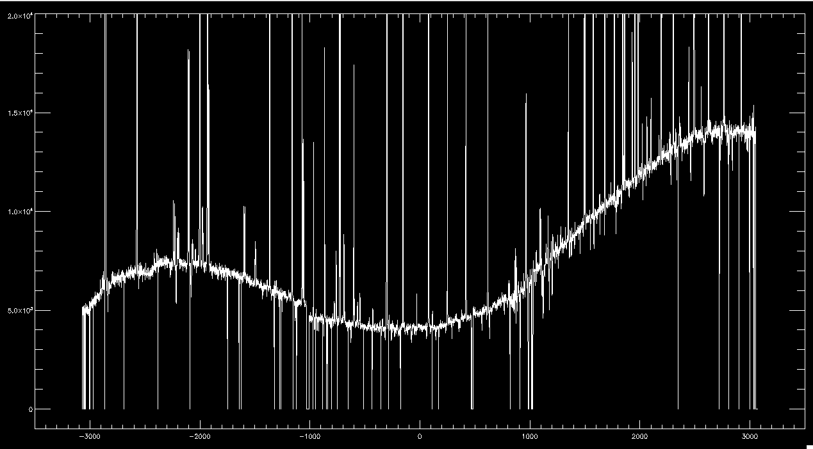
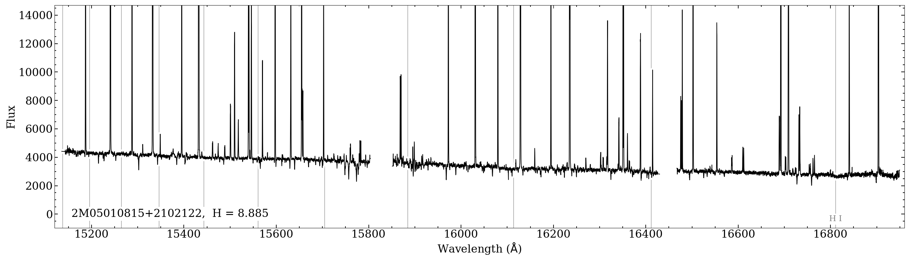

****************
Flux Calibration
****************

APOGEE Flux Calibration
=======================

There are several processing steps that affect the flux calibration and spectral response of the APOGEE Spectra.

1. Flat Calibration
-------------------

The first step that affects the flux calibration is the flat fielding of the 2D images using the apFlat calibration production.  The
apFlat files are made from internal LED flat exposures which use the infrared LEDs on the back of the cold shutter (while the
shutter is open).  While the LED light fully illuminates all three detectors, there still is structure in the spectral dimension (vertical)
from the LED spectrum, and structure in the spatial dimension (horizontal) due to the positional of the LEDs.  It has been difficult to accurately
remove all of this large-scale structure, as would normally be done for a flat field, and it has been left as in the flat image.  Therefore,
the LED SED and some other structure is imprinted in the APOGEE images during the flat-fielding process.
The apFlat calibration is applied at the end of ap3dproc.pro 

The figure below shows the spectral response of two apFlat calibration products.

  The spectral response across the three detectors for two APOGEE Flat calibration files.

2. Relative flux calibration using domeflat
-------------------------------------------

The next step that affects the relative spectral response is using the apFlux calibration product that is made from smoothed versions of
domeflat exposures.  This takes into account the fiber-to-fiber throughput variations and tries to remove variations in spectral response.
After this point, the spectral response should be fairly uniform across the fibers, althought it might not be "correct".
The apFlux calibration is performed at the end of ap2dproc.pro.

The two figures below show how a stellar looks before and after calibration with the apFlux calibration product.  The post-calibration
product looks "smoother" and various structure has been removed.  The overall "wave" feature from the apFlat spectral response is still
visible.  Note that the 

  Stellar spectrum **before** calibration with apFlux

  Stellar spectrum **after** calibration with apFlux

3.Spectral response correction using Telluric stars
---------------------------------------------------

The final spectral response of the APOGEE spectra is set by fitting a 5th order polynomial simultaneously to log(flux) of all of the hot, telluric stars
in an APOGEE field, then leaving in a 1/lambda^4 dependence as expected for the Rayleigh-Jeans tail.  The response function is then applied to all
stars in the visit.  This is is done in ap1dfluxing.pro, which is called by ap1dvisit.pro

4. Absolute Calibration using 2MASS H-mag
-----------------------------------------

The last step is to set the absolute scale of the fluxes using the 2MASS H-magnitude.  This is is done in ap1dfluxing.pro, which is called by ap1dvisit.pro

  Final calibrated stellar spectrum

